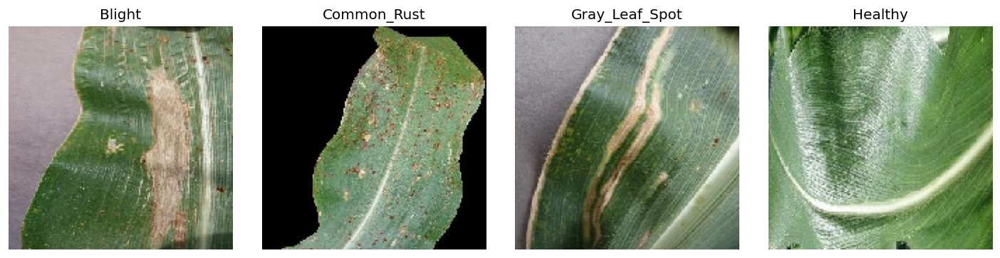
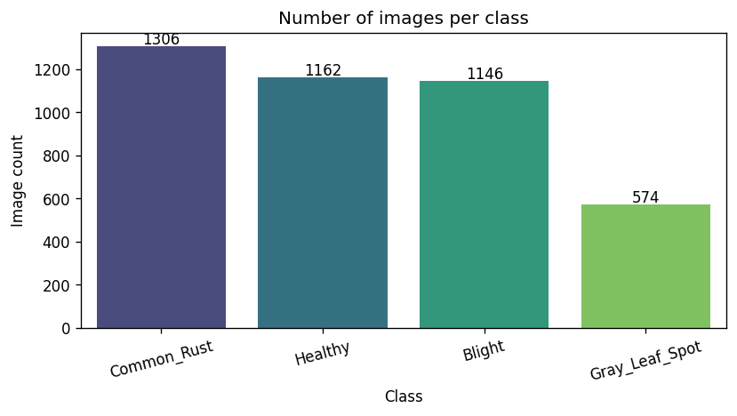
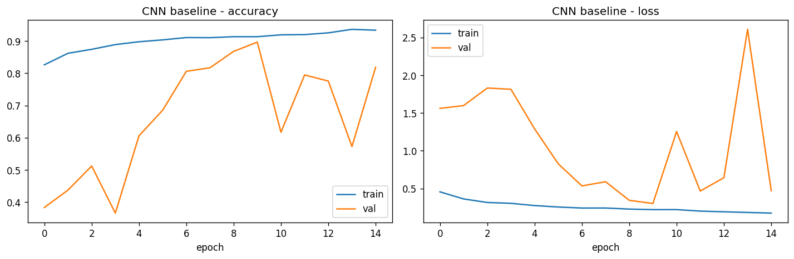
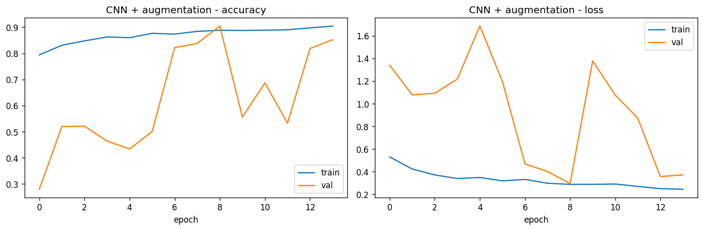
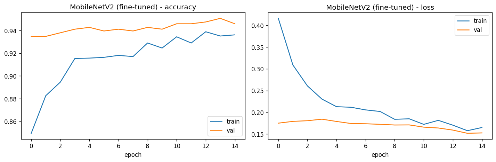
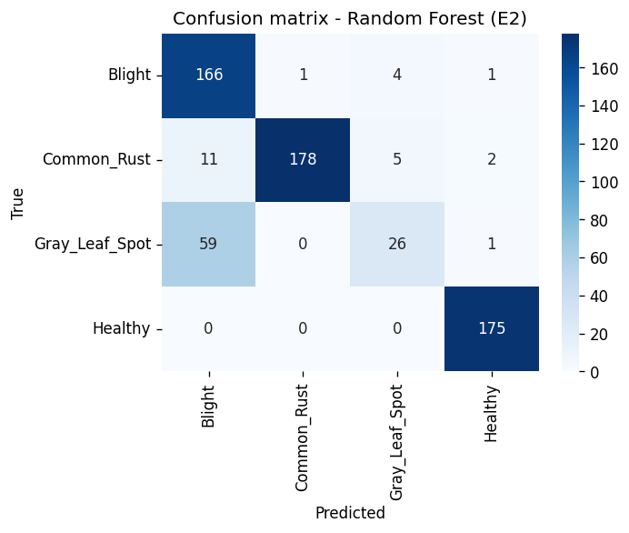
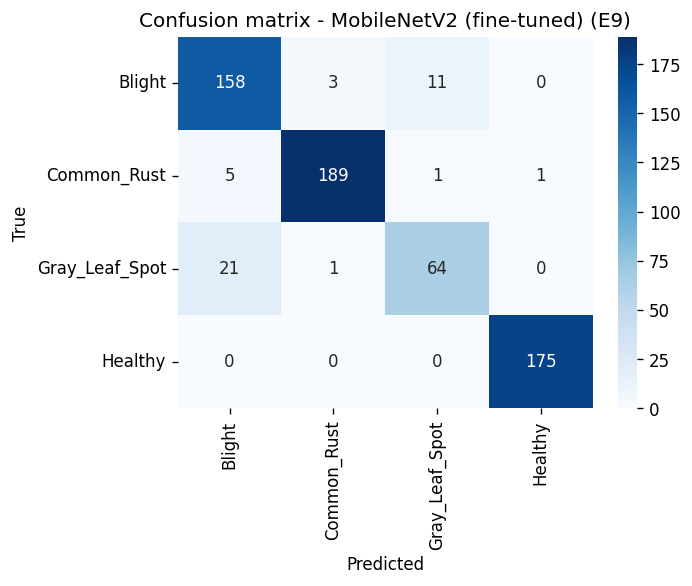
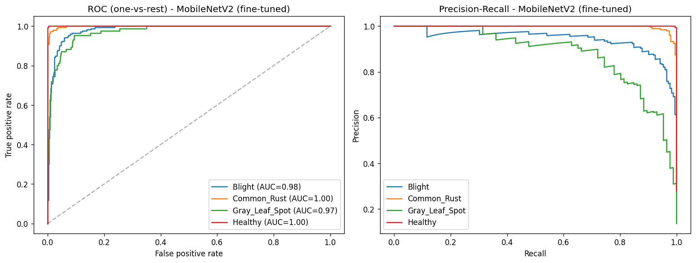

# Comparing Traditional Machine Learning and Deep Learning for Maize Leaf Disease Classification: An Honest Look at What Works and Why

**Author:** Adossi Fred William
**Course:** Introduction to Machine Learning, Summative Project
**GitHub repository:** https://github.com/Adossi-design/maize-leaf-disease-classification
**Presentation video:** https://docs.google.com/presentation/d/1_piAlzaqfzqzOVnwg2V6BCT9THYPzBV1zBZMvfn9g_g/edit?usp=sharing

---

## Abstract

Maize is one of the most important crops for smallholder farmers in East Africa, and if leaf diseases are not caught early they can destroy a big part of the harvest. In this project I built a pipeline that looks at photos of maize leaves and puts them into one of four categories: Blight, Common Rust, Gray Leaf Spot, or Healthy. I then used that pipeline to compare traditional machine learning methods against deep learning methods on the exact same data, using a stratified 70/15/15 train-validation-test split and macro-averaged F1 as my main metric so that the smallest class could not get hidden behind a high overall accuracy number. The traditional side used handcrafted colour and texture features fed into Logistic Regression, Random Forest, and a tuned SVM, while the deep learning side used a CNN I built from scratch and a MobileNetV2 transfer learning model. After nine experiments, the best result came from a fine-tuned MobileNetV2 with 0.932 accuracy and 0.912 macro F1. Some of the most useful findings were the ones I did not expect: deep learning won from the very beginning, augmentation actually made things slightly worse, and two standard fixes for class imbalance both failed to beat the plain baseline. I then turned the best model into a web app that runs on a phone, so that the work could be tested by the people it is meant for rather than staying in a notebook. This report explains the problem, reviews what other researchers have done, describes my methodology, shows my results, discusses what those results really mean, and ends with how the model was deployed.

---

## 1. Introduction

I grew up knowing that maize is the backbone of food security for many families in Rwanda and across East Africa. When a farmer loses their maize crop to disease, it is not just a farming problem, it affects whether a family eats. Diseases like Common Rust, Northern Leaf Blight, and Gray Leaf Spot can wipe out a large portion of the harvest if they are not caught early enough. The problem is that identifying these diseases correctly requires a trained eye, and there are not nearly enough agricultural experts to go around. A farmer in a remote area who cannot tell the difference between Gray Leaf Spot and normal leaf ageing may miss the window to treat it and lose everything.

That is what motivated this project. If a phone app could look at a photo of a sick leaf and tell a farmer what disease it has, that would be genuinely useful. But I did not want to just build something that looks good on paper. I wanted to understand which approach actually works best for this problem, where things go wrong, and whether the tools I had learned in class really do what people say they do. I was especially curious about whether deep learning was truly necessary, or whether a simpler classical approach could get close enough to be useful.

I framed the whole thing as a four-class classification problem over Blight, Common Rust, Gray Leaf Spot, and Healthy leaves and asked three questions. First, how far can traditional machine learning get on this problem using handcrafted features? Second, how much better does deep learning do, and what actually drives that improvement? Third, does the class imbalance in my dataset cause real problems, and do the standard fixes for imbalance actually help? To keep things fair I ran all nine experiments on the exact same data split and reported both accuracy and macro F1 throughout.

The main things this report contributes are a side-by-side comparison of classical and deep learning models on the same maize dataset, a controlled look at what augmentation and imbalance correction actually do, and an honest error analysis that tries to explain where and why each model fails. I think that combination gives a realistic picture of what would really be needed to turn this kind of classifier into something a farmer could actually use.

---

## 2. Literature Review

The research on using images to detect plant diseases really took off once big labelled datasets became available. The most important of these is PlantVillage, which Hughes and Salathe released as a free collection of tens of thousands of labelled leaf images meant to help build mobile disease detection tools [1]. My own dataset is partly drawn from PlantVillage. The most famous result on this data came from Mohanty, Hughes, and Salathe, who trained deep convolutional networks on over fifty thousand images covering many different crops and diseases and got accuracy above ninety-nine percent [2]. That number gets quoted a lot as proof that the problem is basically solved, but the authors themselves pointed out a big catch: when they tested their models on photos taken in real field conditions rather than a lab, performance dropped a lot. That warning was important to me because it means a high score on tidy benchmark data does not necessarily translate to a model that works on a real farm.

Other researchers have confirmed that deep learning works well on clean curated datasets, but almost none of them bother to test a simple classical baseline on the same data. That makes it hard to know whether the CNN is winning because of its architecture or just because of the large amount of clean data it was trained on. That gap in the literature is one of the main things my project tries to address.

Some researchers have worked specifically on maize diseases, which is more directly relevant to my work. Sibiya and Sumbwanyambe trained a CNN on Common Rust, Blight, and a Cercospora spot disease and got accuracy in the low nineties on a small dataset [3], which is basically the same problem I am working on. But they did not test a simpler baseline alongside the deep model, so there is no way to tell whether a well-tuned SVM would have come close.

The dataset I used mixes clean PlantVillage-style images with messier ones from PlantDoc, which is a dataset that Singh and colleagues collected deliberately in uncontrolled field conditions to show how much harder real-world images are [4]. That means my results probably sit somewhere between the very optimistic numbers you see on pure PlantVillage experiments and the harder field-condition numbers that researchers like Singh and colleagues warn about.

For the deep learning side, I used MobileNetV2 from Sandler and colleagues [5] as my transfer learning backbone because it was specifically designed to run on mobile devices, which matches my goal of a phone-based tool for farmers. All three classical models were implemented using scikit-learn [6], and my deep learning pipeline was built with TensorFlow [7].

Looking at all of this together, the two things missing from existing work are a proper classical baseline alongside the deep models, and an honest look at what happens with partly curated data. My project tries to fill both of those gaps at the same time by using the same split for all models, reporting macro F1 so the class imbalance does not hide inside a high average, and looking carefully at what goes wrong rather than just reporting the best number.

---

## 3. Methodology

### 3.1 Dataset

I used the Corn or Maize Leaf Disease dataset from Kaggle, which was put together from PlantVillage [1] and PlantDoc [4]. It has 4,188 colour images across four classes: Common Rust (1,306), Healthy (1,162), Blight (1,146), and Gray Leaf Spot (574). The biggest class is about 2.28 times larger than the smallest, which is a real but fairly mild imbalance. The dataset mixes clean laboratory-style photos with messier field-style ones, which I thought made it a reasonable representation of what a deployed model would actually see.

### 3.2 Data Splitting and Reproducibility

Before I did any preprocessing, I loaded all the image paths and labels into a single dataframe so both the classical and deep learning models would be trained and tested on exactly the same images. I then split everything 70% for training, 15% for validation, and 15% for test using stratified sampling, which keeps the class proportions the same in each split. That matters especially for Gray Leaf Spot because it is so small that a random split could easily leave too few of its images in the test set to get a reliable measurement. I fixed all the random seeds at the top of the notebook so the results come out the same every time.

### 3.3 Two Preprocessing Paths

The classical and deep learning models need the data in completely different formats, so I created two preprocessing pipelines from the same split. For the traditional models, I turned each image into a feature vector manually. I extracted a colour histogram in HSV colour space with eight bins per channel, giving 24 colour features, and then added Histogram of Oriented Gradients (HOG) features to capture the texture and edge structure of any lesions. I used HSV instead of RGB because disease-related colour changes are more obvious when hue and saturation are not mixed up with brightness. Images were resized to 64 by 64 pixels for this path. For the deep learning models I built a tf.data pipeline using TensorFlow [7] that reads, decodes, and resizes each image to 128 by 128 pixels, then scales pixel values to the range [0, 1]. The pipeline caches images after the first read, shuffles during training, batches at 32, and prefetches so the GPU does not sit idle waiting for data.

### 3.4 Traditional Machine Learning Models (Experiments 1 to 3)

I trained three classical models on the handcrafted features, all built with scikit-learn [6]. Experiment 1 (E1) is a Logistic Regression, which I used as the simplest possible linear baseline and the floor that all other models have to beat. Experiment 2 (E2) is a Random Forest with 300 trees, which adds nonlinearity through an ensemble approach, and comparing it to E1 tells me whether the bottleneck is the model type or the features. Experiment 3 (E3) is the strongest classical attempt: an SVM with an RBF kernel where I ran a small grid search over C and gamma using three-fold cross-validation, finding that C equal to 10 and gamma set to scale worked best.

### 3.5 Deep Learning Models (Experiments 4 to 9)

I designed six deep learning experiments so that each one changed only one thing at a time, which made it easier to understand what was actually driving any difference in results. Experiment 4 (E4) is my CNN baseline, a three-block architecture with convolution, batch normalisation, and max-pooling in each block, then global average pooling, dropout at 0.5, and a softmax output trained with Adam at a learning rate of 1e-3 and no augmentation. This gives me a reference point for what a plain from-scratch network can do. Experiment 5 (E5) uses the exact same architecture but switches on a data augmentation pipeline during training that applies random flips, rotations, zoom, and contrast changes, so I can isolate whether augmentation helps. Experiment 6 (E6) keeps everything from E5 but adds class-weighted loss to penalise mistakes on the minority class more, testing whether the mild imbalance is the problem. Experiment 7 (E7) tries a different approach to the imbalance by oversampling the minority class during training instead of adjusting the loss, giving a second independent test of whether imbalance correction matters. Experiment 8 (E8) is my first transfer learning experiment: I loaded an ImageNet-pretrained MobileNetV2 backbone [5], froze all its weights, and trained only a small classification head on top, to measure how much the pretrained features help even without any fine-tuning. Experiment 9 (E9) extends E8 by unfreezing the top thirty layers of the backbone and continuing training at a much lower learning rate of 1e-5, so the model could adapt its higher-level features to maize leaf diseases without completely overwriting what it already learned from ImageNet.

### 3.6 Evaluation

I evaluated every model on the same held-out test set using both overall accuracy and macro-averaged F1. I chose to report macro F1 as my main metric because accuracy alone can look fine even if the model is almost completely ignoring the smallest class, while macro F1 gives each class equal weight regardless of how many samples it has. I also plotted learning curves to check for overfitting, confusion matrices to see which specific classes were getting mixed up, and ROC and Precision-Recall curves to understand how each model handles the imbalance at different confidence thresholds.

---

## 4. Results

Table I shows the test-set results for all nine experiments. I took the numbers directly from the notebook outputs to make sure the report and the code match exactly.

**Table I. Test-set accuracy and macro F1 for all experiments.**

| Experiment | Model                                  | Accuracy | Macro F1 |
|------------|----------------------------------------|----------|----------|
| E1         | Logistic Regression (HSV + HOG)        | 0.852    | 0.815    |
| E2         | Random Forest (HSV + HOG)              | 0.867    | 0.795    |
| E3         | SVM, RBF kernel, tuned (HSV + HOG)     | 0.881    | 0.855    |
| E4         | CNN from scratch, no augmentation      | 0.898    | 0.886    |
| E5         | CNN from scratch, with augmentation    | 0.878    | 0.861    |
| E6         | CNN, augmentation, class weights       | 0.892    | 0.875    |
| E7         | CNN, augmentation, oversampling        | 0.874    | 0.857    |
| E8         | MobileNetV2, frozen backbone           | 0.917    | 0.895    |
| E9         | MobileNetV2, fine-tuned                | **0.932**| **0.912**|

Among the classical models, the tuned SVM came out on top with 0.881 accuracy and 0.855 macro F1. One thing worth pointing out is that the Random Forest had higher accuracy than Logistic Regression but a lower macro F1, which already suggests it was doing better on the big classes while struggling with Gray Leaf Spot.

On the deep learning side, the plain CNN baseline (E4) already beat every classical model at 0.898 / 0.886, though looking at Figure 3 the validation accuracy was quite jumpy, spiking between about 0.57 and 0.90 across training epochs. When I switched augmentation on for E5, the result actually dropped to 0.878 / 0.861, which I did not expect. The two imbalance experiments also both came in below the baseline: E6 got 0.892 / 0.875 and E7 got 0.874 / 0.857. The transfer learning models were clearly in a different league: the frozen MobileNetV2 (E8) reached 0.917 / 0.895 with very little training, and after fine-tuning (E9) it reached 0.932 / 0.912, the best result of the entire project.

Looking at the figures helps explain why things went the way they did. Figure 1 shows why this is a hard problem: Common Rust has very visible orange pustules that stand out clearly, but Gray Leaf Spot just looks like dull brownish patches that are easy to confuse with a leaf that is just ageing normally. Figure 2 shows the class imbalance from Section 3.1. Figure 3 makes the difference in training stability really obvious: the from-scratch CNNs have wild, unstable validation curves while the fine-tuned MobileNetV2 is smooth and flat the whole way through. Figure 4 shows that in both confusion matrices, the biggest mistake is Gray Leaf Spot being labelled as Blight. The Random Forest only got 26 out of 86 Gray Leaf Spot test images right, and even my best model only got about 64 of them. Figure 5 confirms this pattern: Gray Leaf Spot has the lowest area under the Precision-Recall curve no matter which model you look at, which tells me the difficulty is in the class itself and not just a side effect of any particular model choice.

---

**Figure 1. One representative image from each of the four classes.**

---

**Figure 2. Number of images per class, showing the 2.28-to-1 imbalance.**

---

**Figure 3. Training and validation learning curves for E4, E5, and E9.**

---

**Figure 4. Confusion matrices for the Random Forest (E2) and the fine-tuned MobileNetV2 (E9).**

---

**Figure 5. Per-class ROC and Precision-Recall curves for the fine-tuned MobileNetV2 (E9).**

---

## 5. Discussion

The result that surprised me most was not MobileNetV2 winning, but how well the classical SVM did. Getting 0.881 accuracy and 0.855 macro F1 from nothing but colour histograms and HOG features is genuinely good, and it shows that classical machine learning is still worth trying before jumping straight to deep learning, especially when you have limited data or limited computing power. That said, even my simplest CNN (E4) beat all three classical models at 0.898, and I think the reason comes down to what each approach can actually represent. The HOG and HSV features I engineered are fixed, so they can only capture what I told them to capture. The CNN learns its own filters directly from the pixel data, so it can pick up on subtle spatial patterns in the lesions that no handcrafted descriptor would think to look for. The classical models hit a ceiling because their feature representation is not flexible enough, not because the SVM or the Random Forest is a bad algorithm.

The augmentation result genuinely puzzled me at first. I expected augmentation to help because that is what everyone seems to recommend, but when I switched it on for E5, accuracy went from 0.898 down to 0.878. Looking at the learning curves in Figure 3 made the reason clear: the baseline CNN was not seriously overfitting in the first place, so there was no real problem for augmentation to fix. The augmented images just made the training harder without giving the model anything it could not already handle. The lesson I took from this is that augmentation is a tool to check, not a default to apply, and it needs to be tested against the plain baseline before you decide to use it.

The imbalance experiments told a similar story. Both class weighting (E6) and oversampling (E7) came in below the plain baseline, at 0.892 / 0.875 and 0.874 / 0.857 respectively. My interpretation is that a 2.28 to 1 ratio is just not severe enough to cause the kind of problem these techniques are designed to fix. At 574 images, Gray Leaf Spot is small but not invisible. What seems to have happened is that forcing extra weight or extra copies of minority class images introduced noise or made the model overfit to imperfect examples, which hurt rather than helped. This feels like an important thing to know because in practice people often reach for these fixes as a reflex whenever they see any imbalance, even a mild one.

Transfer learning worked really well. The frozen MobileNetV2 (E8) hit 0.917 / 0.895 almost immediately because it was already starting from a strong set of visual features learned from ImageNet training: basic edge and colour detectors in the early layers, texture and shape detectors in the middle, and more abstract concept detectors near the top. When I unfroze the top thirty layers and continued training at 1e-5 for E9, the model could adjust those higher-level features to better match the specific appearance of maize leaf diseases, which pushed accuracy up to 0.932 and macro F1 to 0.912. What I found just as convincing as the accuracy number is the stability in Figure 3: the E9 validation curves are smooth and track the training curves closely the whole way through, while the from-scratch CNNs spike all over the place. That stability tells me the pretrained starting point is doing a lot of the work.

In terms of bias and variance, the pattern across all nine experiments is pretty clear. The classical models have high bias because their fixed features are not expressive enough to fully separate the four classes. The from-scratch CNNs have lower bias but noticeably higher variance, which shows up as the unstable training curves and the fact that small changes like adding augmentation or reweighting the loss can move the results in unexpected directions. The fine-tuned MobileNetV2 achieves low bias and low variance at the same time, because the pretrained initialisation gives the optimiser a good starting point and keeps it from wandering into bad solutions. For a project like mine, where the goal is a real tool that a farmer could rely on, transfer learning from a mobile-friendly backbone is clearly the right approach.

The one consistent failure across all models is Gray Leaf Spot. It is the class every model confuses most often with Blight, and looking at the sample images in Figure 1 it is not hard to see why: both diseases produce irregular brownish patches on the leaf, and without clear visual markers like the orange pustules of Common Rust, the difference is much harder to learn. The confusion matrices in Figure 4 show just how persistent this problem is. Part of it is the model, but I think the bigger part is the data: Gray Leaf Spot has the fewest images, and those images come from a mix of clean lab conditions and messy field conditions, so the model has to learn a harder concept with less and noisier data than any other class. This connects directly to the warning from Mohanty et al. [2] and Singh et al. [4] that performance on partly curated data can be quite optimistic. My 0.932 accuracy is a promising result but it is a laboratory number, not a field number, and I think it is important to be honest about that.

---

## 6. Deployment: Putting the Model in a Farmer's Hands

A result that only exists inside a notebook cannot help anyone, so the last part of this project was turning E9 into something a farmer can actually open on a phone. The app asks for one photo of a single leaf and answers with the disease, how sure it is, and what the farmer can do next. It is live at https://maize-leaf-disease-classification.vercel.app and the code sits in the same repository as the notebook.

The model runs inside the browser rather than on a server. I converted the fine-tuned MobileNetV2 to TensorFlow.js and quantised the weights to sixteen bits, which brings the download to about 4.5 MB, and the page stores itself and the model on the phone the first time it is opened. That choice follows directly from who the app is for. A farmer in a village with weak signal cannot wait for a server round trip for every photo, and many would rather their photos never left the phone at all. Once the page has loaded once, the whole thing keeps working with no network.

Getting the trained model into the browser was not a straight copy. The training graph carries the augmentation block and the MobileNetV2 preprocessing step inside it as operations that the converter cannot freeze, so I rebuilt the network for inference as a rescaling layer, the MobileNetV2 backbone, global average pooling and the dense classifier, and copied the trained weights across. At inference the augmentation does nothing and the preprocessing is exactly the arithmetic the rescaling layer performs, so the two models should compute the same thing, but I checked rather than assumed. On forty-eight test images the two agreed on every label with a largest probability difference of three parts in a million, and once converted, the model running in the browser matched the Python model to within half a percentage point. The deployed model was retrained from the same split recorded in split.csv and scores 0.930 accuracy and 0.910 macro F1, which sits within normal run-to-run variation of the 0.932 and 0.912 reported in Table I.

The part I thought hardest about was not the model but what the app says when it is unsure, because a confident wrong answer costs a farmer money he cannot spare. The app only names a disease when the model is at least 55 percent sure, and below that it says plainly that it cannot tell and asks for another photo. Between 55 and 80 percent it reports the answer but asks the farmer to check a second leaf. It also checks the photo itself before reading it, warning when the image is too dark, too bright or blurry, and refusing photos with almost no green leaf in them, since the model only knows maize and would otherwise force one of its four answers onto a picture of anything at all. Whenever the answer is Blight or Gray Leaf Spot, the app repeats the finding from Section 5, that the model called eighteen of the eighty-six Gray Leaf Spot test leaves Blight, and every result ends by telling the farmer to confirm with a local agricultural extension officer before spending money on treatment.

One example makes the limitation concrete. The app offers four sample photos, one per class, and the Gray Leaf Spot sample is read as Blight with 98 percent confidence. That single case says more about the honest state of this work than the headline accuracy does. The model is right about nine times in ten, but when it is wrong on this particular pair it can be wrong with great confidence, which is exactly why the interface hedges and why the advice always points back to a human expert.

---

## 7. Conclusion and Future Work

This project compared traditional machine learning and deep learning for maize leaf disease classification in a way that I tried to keep as honest as possible, using the same data split for everything, reporting a metric that cannot hide the smallest class, and looking at the errors as carefully as the successes. The best result was a fine-tuned MobileNetV2 at 0.932 accuracy and 0.912 macro F1, but the results I found most interesting were the surprises. Deep learning won from the start, but the classical SVM was far from embarrassing. Augmentation hurt rather than helped. Class imbalance fixes both made things worse. And every single model struggled most with Gray Leaf Spot for reasons that are as much about the data as about the model.

The end goal I cared about most, packaging the model into something a farmer can open on a phone, is now done and described in Section 6, but building it is not the same as proving it works. The next step is to put the app in front of real smallholder farmers in Rwanda and watch what happens when they photograph their own leaves in their own fields, because every number in this report comes from photos taken by someone else under conditions I did not control.

Beyond that, the most obvious direction is to collect more Gray Leaf Spot images taken in real field conditions. That would close the class imbalance and improve the training diversity for the hardest class at the same time, and it is the one change most likely to fix the failure I show at the end of Section 6. It would also be worth testing a bigger backbone such as EfficientNet to see whether extra capacity makes a meaningful difference, and evaluating the fine-tuned MobileNetV2 on a completely separate field dataset that played no part in training, which would give a much more honest picture of how the tool behaves outside this dataset.

---

## References

[1] D. P. Hughes and M. Salathe, "An open access repository of images on plant health to enable the development of mobile disease diagnostics through machine learning and crowdsourcing," *arXiv preprint arXiv:1511.08060*, 2015.

[2] S. P. Mohanty, D. P. Hughes, and M. Salathe, "Using deep learning for image-based plant disease detection," *Frontiers in Plant Science*, vol. 7, art. 1419, 2016.

[3] M. Sibiya and M. Sumbwanyambe, "A computational procedure for the recognition and classification of maize leaf diseases out of healthy leaves using convolutional neural networks," *AgriEngineering*, vol. 1, no. 1, pp. 119-131, 2019.

[4] D. Singh et al., "PlantDoc: A dataset for visual plant disease detection," in *Proc. 7th ACM IKDD CoDS and 25th COMAD*, 2020, pp. 249-253.

[5] M. Sandler et al., "MobileNetV2: Inverted residuals and linear bottlenecks," in *Proc. IEEE/CVF CVPR*, 2018, pp. 4510-4520.

[6] F. Pedregosa et al., "Scikit-learn: Machine learning in Python," *Journal of Machine Learning Research*, vol. 12, pp. 2825-2830, 2011.

[7] M. Abadi et al., "TensorFlow: Large-scale machine learning on heterogeneous distributed systems," *arXiv preprint arXiv:1603.04467*, 2016.
